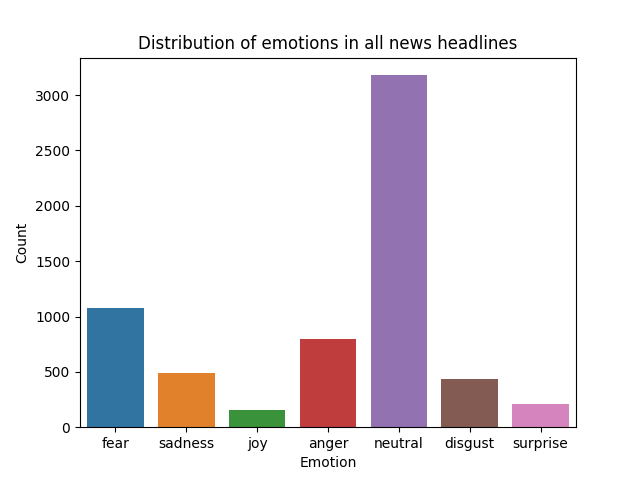
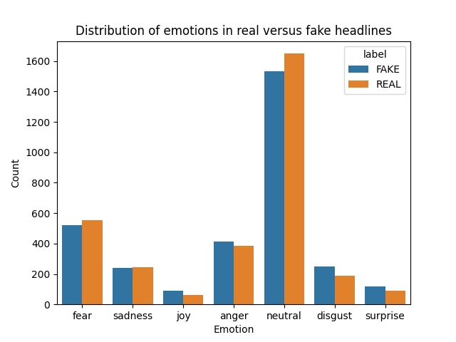

<br />
  <h1 align="center">Assignment 4: Using finetuned transformers via HuggingFace</h1> 
  <h2 align="center">Cultural Data Science, 2023</h2> 
  <h3 align="center">
  Author: Aleksander Moeslund Wael <br>
  Student no. 202005192
  </h3>
</p>

## Assignment notes (Ross)
In previous assignments, you've done a lot of model training of various kinds of complexity, such as training document classifiers or RNN language models. This assignment is more like Assignment 1, in that it's about *feature extraction*.

For this assignment, you should use ```HuggingFace``` to extract information from the *Fake or Real News* dataset that we've worked with previously.

You should write code and documentation which addresses the following tasks:

- Initalize a ```HuggingFace``` pipeline for emotion classification
- Perform emotion classification for every *headline* in the data
- Assuming the most likely prediction is the correct label, create tables and visualisations which show the following:
  - Distribution of emotions across all of the data
  - Distribution of emotions across *only* the real news
  - Distribution of emotions across *only* the fake news
- Comparing the results, discuss if there are any key differences between the two sets of headlines
---

## About the project
This repo contains a Python script, `emotion_classification.py`, which performs emotion classification on a text dataset using a finetuned transformer model in the `HuggingFace` pipeline.

### Data
The text data used for this project is the same as for assignment 2, the Fake News Dataset. It consists of 10556 news articles, each containing a title, article text and label. All articles are either real or fake news. For the emotion classification task, only the headlines were used.

### Model
The model used for the emotion classification task is the `j-hartmann/emotion-english-distilroberta-base` transformer model from the HuggingFace platform (Jochen Hartmann, "Emotion English DistilRoBERTa-base". [HuggingFace link](https://huggingface.co/j-hartmann/emotion-english-distilroberta-base/), 2022). The model is a finetuned version of the `distilroberta-base` model. It predicts Ekman's 6 basic emotions plus a neutral class: `anger`, `disgust`, `fear`, `joy`, `neutral`, `sadness` and `surprise`.

### Pipeline
The `emotion_classification.py` script follows these steps:
1. Import dependencies
2. Initialize model pipeline
3. Load data
4. Perform emotion classification on headlines
5. Plot distribution of emotion in all headlines
6. Plot distribution of emotions in real versus fake headlines
7. Save plots to `plots` folder

## Requirements

The code is tested on Python 3.11.2. Futhermore, if your OS is not UNIX-based, a bash-compatible terminal is required for running shell scripts (such as Git for Windows).

## Usage

The repo was setup to work with Windows (the WIN_ files), MacOS and Linux (the MACL_ files).

### 1. Clone repository to desired directory

```bash
git clone https://github.com/alekswael/assignment-4---using-finetuned-transformers
cd assignment-4---using-finetuned-transformers
```
### 2. Run setup script 
**NOTE:** Depending on your OS, run either `WIN_setup.sh` or `MACL_setup.sh`.

The setup script does the following:
1. Creates a virtual environment for the project
2. Activates the virtual environment
3. Installs the correct versions of the packages required
5. Deactivates the virtual environment

```bash
bash WIN_setup.sh
```

### 3. Run pipeline
**NOTE:** Depending on your OS, run either `WIN_run.sh` or `MACL_run.sh`.

Run the `*run.sh` script. The script does the following:
1. Activates the virtual environment
2. Runs `emotion_classification.py` located in the `src` folder
3. Deactivates the virtual environment

```bash
bash WIN_run.sh
```

## Repository structure
This repository has the following structure:
```
│   .gitignore
│   MACL_run.sh
│   MACL_setup.sh
│   README.md
│   requirements.txt
│   WIN_run.sh
│   WIN_setup.sh
│   
├───data
│       fake_or_real_news.csv
│       
├───plots
│       all_data_plot.png
│       separated_plot.png
│       
└───src
        emotion_classification.py
```

## Remark on findings

When gauging at the emotion distribution plot for all headlines, it seems a large proportion were classified as neutral, which I assume is a positive thing when considering news objectivity. Fear and anger are most prevalent after neutral, perhaps due to negativity bias in headlines. Surprisingly, surprise is a somewhat rare classification, which is counter intuitive when considering the nature of news being "new" and therefore surprising in some sense.



*Figure: Distribution of emotions in all news headlines.*

When looking at real versus fake headlines, it seems the classifications are quite similar across all emotions. Fear, neutral and sadness are more prevalent in real news then in fake.



*Figure: Distribution of emotions real versus fake headlines.*